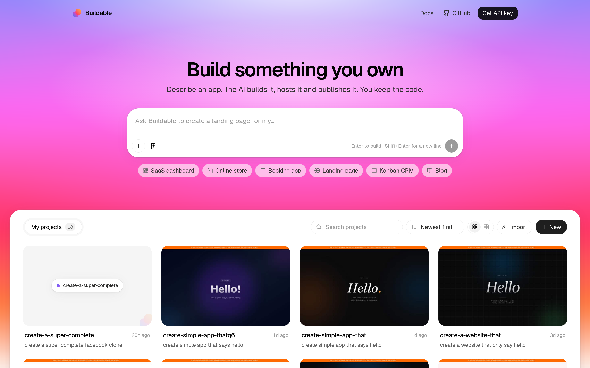
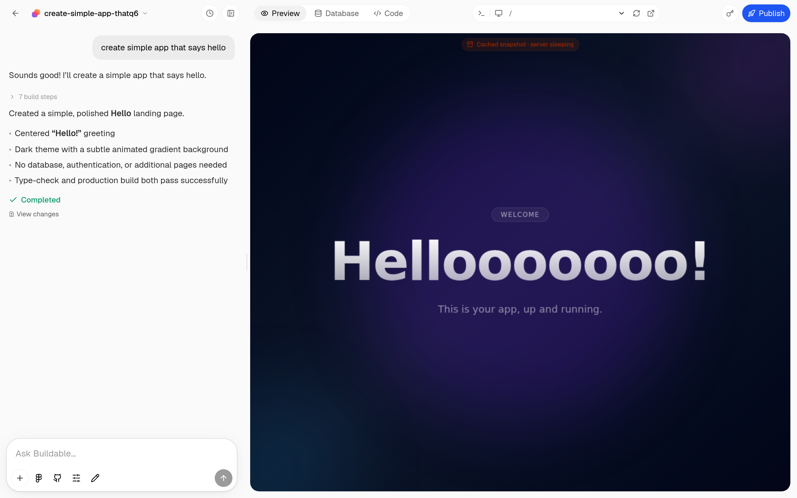

# Buildable: Open Source Lovable Alternative

**Buildable is an open source Lovable alternative you can run yourself.** Describe an app in a chat box, watch an AI agent build a real full-stack Next.js application in a live preview, edit it visually or in code, and publish it to a public URL with its own database, auth, file storage and custom domain. MIT licensed, self-hostable, one API key to run.

It is built for people who like the Lovable workflow but want the code, the hosting and the product in their own hands: indie hackers who want a self-hosted vibe-coding tool, teams who want to embed an AI app builder inside their own SaaS, and agencies who ship client apps under their own brand.

> Buildable is an independent open source project. It is not affiliated with, endorsed by or connected to Lovable Labs Incorporated. "Lovable" is a trademark of its owner and is used here only to describe what this project is an alternative to.

<div align="center">

[](LICENSE)
[](https://nextjs.org)
[](https://react.dev)
[](#deploy-it-anywhere)
[](https://www.totalum.app/api)

[Quick start](#quick-start-five-minutes) · [Lovable vs Buildable](#lovable-vs-buildable-vs-other-open-source-builders) · [Migrating from Lovable](#migrating-from-lovable) · [FAQ](#faq-open-source-lovable-alternatives) · [API docs](https://www.totalum.app/totalum-api.md)

<br/>



<sub>Home: one prompt box, your projects underneath.</sub>

<br/><br/>



<sub>The workspace: chat on the left, the running app on the right, Publish in the corner.</sub>

</div>

---

## Why an open source Lovable alternative?

Lovable made "type a sentence, get an app" mainstream. It also made a few trade-offs that push people to look for a Lovable open source alternative:

- **You rent the builder.** Your projects live inside someone else's product, priced per message.
- **You cannot host it.** There is no self-hosted Lovable, and no way to put the builder inside your own product.
- **You cannot change it.** The chat, the editor, the publish flow: none of it is yours to modify.

Buildable answers those three points directly. The whole builder UI is in this repository under the MIT license. You host it where you like. And because the heavy lifting (the coding agent, sandboxes, hosting, databases, deploys, domains) is done by the [Totalum API](https://www.totalum.app/api) behind a single key, you get a working alternative to Lovable in minutes rather than a weekend of wiring providers together.

The interface deliberately follows the Lovable layout people already know: a warm, light workspace, a chat column on the left, the live app on the right, a centered prompt box on the home page. If you are moving a team off Lovable, nobody has to relearn where things are.

---

## What you get

Every item below works out of the box with one API key. No Supabase project, no Vercel account, no model keys.

| Area | What Buildable does |
| --- | --- |
| **Prompt to app** | Describe the app in plain language. The agent writes a complete Next.js project and keeps iterating from follow-up messages. |
| **Live preview** | The running app updates in the right-hand panel while the agent works. Desktop and phone viewports, route picker, refresh, open in a new tab. |
| **Visual editing** | Click any element in the preview and change its text, size, colors or image. Edits are written back to the exact file and line. |
| **Code editor** | A Monaco (VS Code) editor over every generated file. Save, rebuild, done. |
| **Database** | Each app gets a managed database. Browse tables, filter, edit records, upload files, follow linked records, all from the builder. |
| **Publish** | One click puts the app on a public URL with HTTPS. Progress and logs are shown while it deploys. |
| **Custom domains** | Attach your own domain with guided DNS steps and live status. |
| **GitHub sync** | Connect a repository and push or pull in both directions. |
| **Figma** | Paste a Figma frame link and the agent builds from the design. |
| **Secrets** | Environment variables per project, managed from the UI. |
| **Version history** | Every agent run is a restorable checkpoint with a diff viewer. |
| **Logs** | Development and production logs with search. |
| **Export, import, duplicate** | Package a project into a code, restore it, or clone it. |
| **Run options** | Choose the model, the effort level and fast mode per prompt. |
| **Multi-tenant** | Each project is isolated. Create one per user or per customer and put your own login in front. |

---

## Lovable vs Buildable vs other open source builders

| | **Buildable** | Lovable | dyad | bolt.diy |
| --- | :---: | :---: | :---: | :---: |
| License | MIT | Proprietary | Apache 2.0 + FSL | MIT |
| Self-hostable builder UI | Yes | No | Runs locally | Yes |
| Hosting, database and auth for generated apps included | Yes, one key | Yes | Bring your own | Bring your own |
| Custom domains from the builder | Yes | Yes | No | No |
| Visual click-to-edit | Yes | Yes | Partial | No |
| Database browser in the builder | Yes | Via Supabase | No | No |
| GitHub two-way sync | Yes | Yes | Manual | Manual |
| Embed inside your own SaaS, white-label | Yes | No | No | Possible |
| Output | Full-stack Next.js | React + Supabase | Depends on template | Depends on template |

The point of the comparison is not that the others are bad. dyad and bolt.diy are excellent if you want a local tool with your own model keys. Buildable is the option when you want the *hosted product experience* of Lovable, delivered as open source you control.

---

## Quick start (five minutes)

Requirements: [Node.js](https://nodejs.org) 20 or newer.

```bash
git clone https://github.com/totalumlabs/lovable-alternative.git
cd lovable-alternative
npm install
cp .env.example .env.local
```

Open `.env.local` and set your key:

```bash
TOTALUM_VCAAS_API_KEY=tlm_sk_...
```

Then run it:

```bash
npm run dev
```

Visit [http://localhost:3000](http://localhost:3000), type what you want to build, and press Enter.

### Get an API key

1. Create an account at [totalum.app/api](https://www.totalum.app/api).
2. During onboarding choose **Use the Totalum API**.
3. Copy the key into `.env.local` as `TOTALUM_VCAAS_API_KEY`.

The first 50 AI credits are free. That one key covers the agent, hosting, databases, sandboxes, deploys, domains and GitHub sync for every app you build.

---

## Environment variables

| Variable | Required | Purpose |
| --- | :---: | --- |
| `TOTALUM_VCAAS_API_KEY` | Yes | Your Totalum API key. Read on the server only, never sent to the browser. |
| `NEXT_PUBLIC_APP_URL` | No | Public URL of your deployment, used to allow-list your origin for CSP and CORS. Defaults to the same host. |

The key is read in exactly one file, `src/lib/vcaas-server.ts`, which is marked server-only. Browser code talks to same-origin proxy routes under `/api/vcaas/*`, and the server adds the key before forwarding.

---

## Deploy it anywhere

This is a standard Next.js application. It runs on Vercel, Docker, Railway, Render, Fly.io, a VM, or anything that runs Node.

**Vercel:** import the repository, add `TOTALUM_VCAAS_API_KEY` under Environment Variables, deploy.

**Any Node host:**

```bash
npm run build
npm start   # listens on $PORT, default 3000
```

> **Read before going public.** Buildable ships with **no login**, on purpose, so you can add the auth that fits your stack. Until you do, anyone who can reach the URL can build apps on your key and spend your credits. The two guards to make real are in `src/app/api/vcaas/_shared.ts`, and the pages to protect are listed in `src/proxy.ts`. Running it locally or on a private network without auth is fine.

---

## Migrating from Lovable

You do not need to start from scratch.

1. **Bring the source.** Lovable can push each project to GitHub. In Buildable, create a project, open the GitHub panel in the chat toolbar, connect that repository and ask the agent to port the app to this project's Next.js setup. It reads the code and rebuilds the screens, data model and logic.
2. **Or bring the brief.** Paste your original prompts, or attach screenshots of the Lovable app, and describe what to keep. The agent rebuilds it as a Next.js app with its own database.
3. **Point the domain.** Once the new version is published, attach your custom domain from the Domain panel and follow the DNS steps.

Every project gets a fresh managed database, so migrate data with the database panel (CSV-style paste and file uploads work) or ask the agent to write an import route.

---

## Put a Lovable-style builder inside your own product

Buildable is also a drop-in AI app-builder layer for a SaaS you run or are launching.

- **Multi-tenant by design.** Every generated app is an isolated project. Create one per user, team or customer.
- **White-label.** The name, the logo and the theme live in a handful of files (`src/lib/brand.ts`, `src/app/globals.css`, `src/app/icon.svg`). Rebrand it in an afternoon.
- **One integration.** A single API key gives your users hosting, databases, AI, domains, GitHub and sandboxes.
- **Your login, your billing.** Add Supabase, Clerk or Better Auth for accounts and Stripe for credits. The step-by-step, including where to meter usage, is in [`AGENTS.md`](AGENTS.md#boilerplate-mode-login-with-supabase-payments-with-stripe).

If you would rather keep your own frontend, keep the contract instead of the UI: a server-side proxy that adds the `api-key` header, then launch a project, poll the agent, show the preview URL, send follow-ups, deploy. [`AGENTS.md`](AGENTS.md#adding-an-ai-app-builder-to-an-existing-product-any-stack) lists the exact files to mirror.

---

## How it works

```
┌───────────────────────────────────────────────────────────┐
│  Buildable (this repo, Next.js 16)                        │
│                                                           │
│   pages & panels ──► src/lib/vcaas.ts (typed API client)  │
│                          │ same-origin fetch              │
│                          ▼                                │
│   /api/vcaas/*  server proxy, adds the api-key header     │
└──────────────────────────────┬────────────────────────────┘
                               │ HTTPS
                               ▼
              ╔════════════════════════════════════╗
              ║  Totalum API                       ║
              ║  coding agent · sandboxes          ║
              ║  hosting · database · deploys      ║
              ║  domains · GitHub · Figma · logs   ║
              ╚════════════════════════════════════╝
```

Three things worth knowing:

- **Every Totalum call goes through one file.** The browser side is `src/lib/vcaas.ts`; the server half that holds the key is `src/lib/vcaas-server.ts`. To see how an endpoint is called, polled and error-handled, read there.
- **Agent runs and deploys are asynchronous.** The UI polls status every 10 to 15 seconds and never assumes completion from the start response.
- **Credits belong to the operator.** All actions run on the key in your environment. When it runs out, the app says so once and links to the billing page. That message is for you, not your users. Remove it before you sell this.

Full API reference, written for humans and AI coding assistants alike: [www.totalum.app/totalum-api.md](https://www.totalum.app/totalum-api.md). Browsable docs: [www.totalum.app/docs](https://www.totalum.app/docs).

---

## Project layout

```
src/
├─ app/
│  ├─ page.tsx                  # Home: centered prompt box + your projects
│  ├─ project/[projectId]/      # Workspace: chat, preview, code, database, modals
│  └─ api/
│     ├─ vcaas/[...path]/       # Server proxy to the Totalum API
│     ├─ preview/[projectId]/   # Same-origin preview proxy (needed by the visual editor)
│     ├─ visual-edit/…/apply    # Turns visual edits into real source edits
│     └─ config/                # Reports whether the API key is set
├─ components/
│  ├─ brand/                    # Logo mark and wordmark
│  └─ workspace/                # Chat, preview, code, database, GitHub, Figma, logs…
├─ lib/
│  ├─ brand.ts                  # Product name, tagline, links: change these to rebrand
│  ├─ vcaas.ts                  # The API client (browser side)
│  ├─ vcaas-server.ts           # The half that holds the key (server only)
│  └─ visual-edit*.ts           # Matching a clicked element back to its source
└─ app/globals.css              # Theme tokens (the Lovable-style warm light palette)
AGENTS.md                       # Map of the repo for AI coding agents and contributors
```

---

## FAQ: open source Lovable alternatives

### Is there an open source Lovable?

Lovable itself is closed source. Buildable is an open source Lovable alternative under the MIT license: the same prompt-to-app workflow, the same layout, and you can read, modify and host every line of the builder.

### What is the best Lovable alternative that is open source?

It depends on what you want. If you want a local desktop tool with your own model keys, look at dyad or bolt.diy. If you want the hosted-product experience of Lovable (apps that come with hosting, a database, auth and domains) delivered as open source you can self-host and embed, Buildable is built for exactly that.

### Can I self-host a Lovable alternative?

Yes. Buildable runs anywhere Next.js runs. Clone it, add one API key, run `npm run build && npm start`. The generated apps are hosted by the Totalum API, so you do not run sandboxes or databases yourself.

### Is it really free?

The code is free and MIT licensed. Running it needs a Totalum API key, which starts with 50 free credits and then charges for usage. There are no per-seat fees for the builder itself. See [pricing](https://www.totalum.app/api#pricing).

### Does it look like Lovable?

The layout and the light, warm palette follow the conventions Lovable users know, so switching is painless. The logo, name and code are entirely our own, and you are encouraged to rebrand it.

### What can it build?

Full-stack Next.js web apps: SaaS MVPs, CRMs, dashboards, internal tools, marketplaces, booking systems, landing pages with a backend, and more. Each app has its own database and can use secrets for third-party APIs.

### How is this different from `ai-app-builder-open`?

Same engine, different edition. [`ai-app-builder-open`](https://github.com/totalumlabs/ai-app-builder-open) is the neutral, white-label starter. Buildable is the edition themed for people coming from Lovable, with a README and defaults aimed at that switch. Fixes flow between the two.

---

## Contributing

Bug reports, panels, docs and ideas are all welcome.

1. Fork and branch: `git checkout -b my-change`
2. Read [`AGENTS.md`](AGENTS.md) for the layout and the rules that are not obvious from the code.
3. Run `npx tsc --noEmit` and `npm run build`, open the changed screen with a real key, then open a pull request that says what changed, why, and how you verified it.

Found a problem? [Open an issue](https://github.com/totalumlabs/lovable-alternative/issues).

---

## License and trademarks

Buildable is released under the [MIT License](LICENSE). Free for personal and commercial use.

Lovable is a trademark of Lovable Labs Incorporated. Buildable is not affiliated with, sponsored by or endorsed by Lovable Labs. Other product names mentioned in the comparison belong to their respective owners.

---

<div align="center">

**Open source Lovable alternative** · self-hosted AI app builder · prompt to full-stack Next.js app · MIT

If Buildable saves you a subscription, a star helps the next person find it.

Runs on the [Totalum API](https://www.totalum.app/api) · [Docs](https://www.totalum.app/docs) · [Get a free key](https://www.totalum.app/api)

</div>
