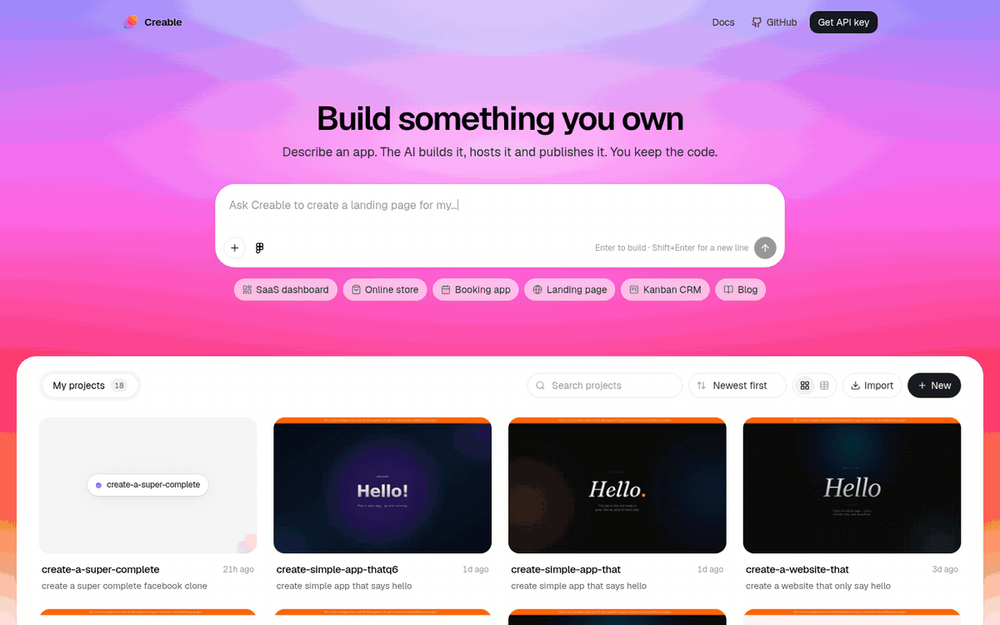

# Creable: Open Source Lovable Alternative

**Creable is an open source Lovable alternative you can self-host, rebrand and resell.** Describe an app in a chat box, watch an AI agent build a real **full-stack Next.js application with its own database** in a live preview, edit it visually or in code, and publish it to a public URL with hosting, auth, file storage and a custom domain. MIT licensed. One API key to run.

- **Same workflow as Lovable.** Prompt, preview, iterate, publish. The interface follows the layout Lovable users already know.
- **Better output than Lovable for search.** Every app is a server-rendered Next.js project with an integrated database, not a client-side React bundle, so what you ship is crawlable by Google and by AI search engines from day one.
- **Yours to run and sell.** Add sign-up and login, put your brand on it, charge for it, or drop the whole AI app-builder capability into the SaaS you already have. All of it is supported by the [Totalum API](https://www.totalum.app/whitelabel).

> Creable is an independent open source project. It is not affiliated with, endorsed by or connected to Lovable Labs Incorporated. "Lovable" is a trademark of its owner, used here only to describe what this project is an alternative to.

<div align="center">

[](LICENSE)
[](https://nextjs.org)
[](https://react.dev)
[](https://www.typescriptlang.org)
[](.nvmrc)
[](#deploy-it-anywhere)
[](https://www.totalum.app/whitelabel)
[](https://github.com/totalumlabs/lovable-alternative/stargazers)

[Quick start](#quick-start-five-minutes) · [Lovable vs Creable](#lovable-vs-creable-vs-other-open-source-ai-app-builders) · [Resell or embed it](#resell-it-white-label-it-or-put-it-inside-your-own-saas) · [Better SEO than Lovable](#better-seo-than-lovable-server-rendered-nextjs-with-the-database-built-in) · [Migrating from Lovable](#migrating-from-lovable) · [FAQ](#faq-open-source-lovable-alternatives)

<br/>



<sub>Prompt on the home page, then the workspace: chat, live preview, code explorer, phone view and one-click publish.</sub>

</div>

---

## Contents

- [What is Creable?](#what-is-creable)
- [Why look for an open source Lovable alternative?](#why-look-for-an-open-source-lovable-alternative)
- [What you get](#what-you-get)
- [Better SEO than Lovable](#better-seo-than-lovable-server-rendered-nextjs-with-the-database-built-in)
- [Resell it, white-label it, or put it inside your own SaaS](#resell-it-white-label-it-or-put-it-inside-your-own-saas)
- [Lovable vs Creable vs other open source AI app builders](#lovable-vs-creable-vs-other-open-source-ai-app-builders)
- [Quick start](#quick-start-five-minutes)
- [Environment variables](#environment-variables)
- [Deploy it anywhere](#deploy-it-anywhere)
- [Migrating from Lovable](#migrating-from-lovable)
- [How it works](#how-it-works)
- [Project layout](#project-layout)
- [FAQ](#faq-open-source-lovable-alternatives)
- [Contributing](#contributing)
- [License and trademarks](#license-and-trademarks)

---

## What is Creable?

Creable is an **open source AI app builder** in the style of Lovable: you chat, an AI coding agent writes the application, you watch it run in a live preview, refine it with follow-up prompts or by clicking on elements, and publish it with one click.

What makes it a real alternative rather than a demo:

- **It ships complete apps.** Each project is a full-stack Next.js codebase with an integrated database, authentication, file storage, secrets, hosting with HTTPS, a custom domain and logs. Not a front-end mock.
- **It is the whole product, open source.** The home page, the workspace, the chat, the visual editor, the code editor, the database browser, the publish flow and the version history are all in this repository under the MIT license.
- **It needs one key, not five vendors.** The coding agent, the sandboxes, the hosting, the databases, the deploys and the domains are provided by the [Totalum API](https://www.totalum.app/api). Clone, paste the key, run.
- **It is meant to be rebranded and resold.** Creable is a thin client in front of that API. Add your own login and billing, or embed it in your existing software, and you have an AI app builder under your own name. See [Resell it, white-label it](#resell-it-white-label-it-or-put-it-inside-your-own-saas).

**Lovable**, for comparison, is a closed-source hosted product: you rent the builder per message, you cannot host it, you cannot modify it, and you cannot offer it to your own customers.

---

## Why look for an open source Lovable alternative?

Lovable made "type a sentence, get an app" mainstream. It also made trade-offs that send people searching for a Lovable open source alternative:

| The Lovable trade-off | What Creable does instead |
| --- | --- |
| You rent the builder, priced per message, inside someone else's product. | The builder is MIT code on your own server. Usage is billed by the API, with 50 free credits to start and no per-seat fee. |
| No self-hosted Lovable exists. | Runs anywhere Next.js runs: Vercel, Docker, a VM, Railway, Render, Fly.io. |
| You cannot change the chat, the editor or the publish flow. | Every screen is source code you can edit. Rename it, restyle it, remove features, add your own. |
| You cannot offer Lovable to your customers under your brand. | White-label and multi-tenant by design. Sell it, or embed it inside your SaaS. |
| Generated apps are client-rendered React by default. | Generated apps are server-rendered Next.js with a real database, better for SEO and for AI search. |

---

## What you get

Every item below works out of the box with one API key. No Supabase project, no Vercel account, no model keys.

| Area | What Creable does |
| --- | --- |
| **Prompt to app** | Describe the app in plain language. The agent writes a complete Next.js project and keeps iterating from follow-up messages. |
| **Live preview** | The running app updates in the right-hand panel while the agent works. Desktop and phone viewports, route picker, refresh, open in a new tab. |
| **Visual editing** | Click any element in the preview and change its text, size, colors or image. Edits are written back to the exact file and line. Desktop browsers only. |
| **Code editor** | A Monaco (VS Code) editor over every generated file. Save, rebuild, done. |
| **Integrated database** | Each app gets a managed database with no setup. Browse tables, filter, edit records, upload files, follow linked records, all from the builder. |
| **Auth and storage** | Generated apps can use accounts, roles, sessions and file uploads without you provisioning anything. |
| **Publish** | One click puts the app on a public URL with HTTPS. Progress and logs are shown while it deploys. |
| **Custom domains** | Attach your own domain with guided DNS steps and live status. |
| **GitHub sync** | Connect a repository and push or pull in both directions. |
| **Figma** | Paste a Figma frame link and the agent builds from the design. |
| **Secrets** | Environment variables per project, managed from the UI. |
| **Version history** | Every agent run is a restorable checkpoint with a diff viewer. |
| **Logs** | Development and production logs with search. |
| **Export, import, duplicate** | Package a project into a code, restore it, or clone it. |
| **Attachments** | Attach images, PDFs and SVGs to a prompt (up to 8 MB each), or paste a screenshot with ⌘/Ctrl+V. |
| **Run options** | Choose the model, the effort level and fast mode per prompt. |
| **Multi-tenant** | Each project is isolated. Create one per user or per customer and put your own login in front. |

---

## Better SEO than Lovable: server-rendered Next.js with the database built in

Most AI app builders, Lovable included, generate a client-rendered single-page React app: an empty HTML shell plus a JavaScript bundle that draws the page in the browser. That is fine for an internal tool. It is a handicap for anything that needs to be found.

**Creable generates full-stack Next.js projects.** In practice that means:

- **Server-rendered pages.** Google, Bing and AI crawlers receive complete HTML with the content already in it, not a blank shell waiting for JavaScript.
- **Real metadata per page.** Titles, descriptions, Open Graph and Twitter cards, canonical URLs, sitemaps and robots rules are first-class in Next.js, and the agent uses them.
- **Fast by default.** Streaming, code splitting, image optimization and caching are built in, which is what Core Web Vitals reward.
- **A database that is part of the app, not bolted on.** Data-driven pages (listings, profiles, blog posts, product pages) render on the server from the integrated database, so every record can be its own indexable URL.
- **The same stack for the front end and the back end.** API routes, server actions, auth and file storage live in one codebase you can export to GitHub and run anywhere.

If the apps you build are landing pages, marketplaces, directories, blogs, shops or anything else that lives or dies by search traffic, this is the difference that matters.

---

## Resell it, white-label it, or put it inside your own SaaS

Creable is not only a tool for yourself. It is a ready-made **AI app-builder capability you can offer to your own users**, because everything behind it (the coding agent, sandboxes, hosting, databases, deploys, domains, GitHub sync) is exposed by the [Totalum API](https://www.totalum.app/whitelabel) and works multi-tenant out of the box.

Three ways people use it:

1. **Launch your own Lovable-style product.** Add sign-up and login (Supabase, Clerk, Better Auth or your own), add billing (Stripe credit packs or plans), put your name and logo on it, and sell it. Every project belongs to the user who created it. The step-by-step is in [`AGENTS.md`](AGENTS.md#boilerplate-mode-login-with-supabase-payments-with-stripe).
2. **Add an AI app builder to the SaaS you already run.** Deploy Creable on a subdomain behind your existing login, or port the flow into your own stack: a server-side proxy that adds the API key, then launch a project, poll the agent, show the preview, deploy. One project per customer, ownership checked on every call. Details in [`AGENTS.md`](AGENTS.md#adding-an-ai-app-builder-to-an-existing-product-any-stack).
3. **Ship client work faster as an agency.** Build under your brand, hand over the GitHub repository or keep hosting it for the client, on their domain.

What the platform handles for you: isolated projects per tenant, hosting and SSL, databases and backups, the AI agent and its sandboxes, deploys, custom domains, GitHub and Figma integrations, logs and usage metering. What you own: the UI, the brand, the pricing and the customer relationship.

Read how the white-label offer works, including pricing and the reseller terms, at **[totalum.app/whitelabel](https://www.totalum.app/whitelabel)**.

> **Before you put real users behind it**, read `src/app/api/vcaas/_shared.ts`. This repository runs on one API key and ships with no login, so "who is asking?" and "may they touch this project?" are answered with "yes" by default. That file is where your auth and ownership checks go. The API routes already delegate the decision to it.

---

## Lovable vs Creable vs other open source AI app builders

| | **Creable** | Lovable | dyad | bolt.diy | open-lovable |
| --- | :---: | :---: | :---: | :---: | :---: |
| License | MIT | Proprietary | Apache 2.0 + FSL | MIT | MIT |
| Self-hostable builder UI | Yes | No | Runs locally | Yes | Yes |
| Hosting, database and auth for generated apps included | Yes, one key | Yes | Bring your own | Bring your own | Bring your own |
| Generated app output | Server-rendered full-stack Next.js | Client-rendered React + Supabase | Depends on template | Depends on template | React front end |
| Integrated database browser in the builder | Yes | Via Supabase | No | No | No |
| Visual click-to-edit | Yes | Yes | Partial | No | No |
| Custom domains from the builder | Yes | Yes | No | No | No |
| GitHub two-way sync | Yes | Yes | Manual | Manual | Manual |
| Resell under your brand, embed in your SaaS | Yes | No | No | Possible | Possible |
| Sign-up, login and billing ready to add | Documented | n/a | No | No | No |

dyad and bolt.diy are excellent local tools if you want to bring your own model keys and host what you build yourself. open-lovable is a website-cloning demo. Creable is the option when you want the *hosted product experience* of Lovable, delivered as open source you control and can sell.

---

## Quick start (five minutes)

Requirements: [Node.js](https://nodejs.org) 20 or newer.

```bash
git clone https://github.com/totalumlabs/lovable-alternative.git
cd lovable-alternative
npm install
cp .env.example .env.local
```

Open `.env.local` and set your key:

```bash
TOTALUM_VCAAS_API_KEY=tlm_sk_...
```

Then run it:

```bash
npm run dev
```

Visit [http://localhost:3000](http://localhost:3000), type what you want to build, and press Enter. Shift+Enter adds a line break.

### Get an API key

1. Create an account at [totalum.app/api](https://www.totalum.app/api).
2. During onboarding choose **Use the Totalum API**.
3. Copy the key into `.env.local` as `TOTALUM_VCAAS_API_KEY`.

The first 50 AI credits are free. That one key covers the agent, hosting, databases, sandboxes, deploys, domains and GitHub sync for every app you build.

---

## Environment variables

| Variable | Required | Purpose |
| --- | :---: | --- |
| `TOTALUM_VCAAS_API_KEY` | Yes | Your Totalum API key. Read on the server only, never sent to the browser. |
| `NEXT_PUBLIC_APP_URL` | No | Public URL of your deployment, used to allow-list your origin for CSP and CORS. Defaults to the same host. |

`.env.local` is gitignored, so the key never ends up in a commit. The key is read in exactly one file, `src/lib/vcaas-server.ts`, which is marked server-only. Browser code talks to same-origin proxy routes under `/api/vcaas/*`, and the server adds the key before forwarding.

---

## Deploy it anywhere

This is a standard Next.js application. It runs on Vercel, Docker, Railway, Render, Fly.io, a VM, or anything that runs Node.

**Vercel:** import the repository, add `TOTALUM_VCAAS_API_KEY` under Environment Variables, deploy.

**Any Node host:**

```bash
npm run build
npm start   # listens on $PORT, default 3000
```

> **Read before going public.** Creable ships with **no login**, on purpose, so you can add the auth that fits your stack. Until you do, anyone who can reach the URL can build apps on your key and spend your credits. The two guards to make real are in `src/app/api/vcaas/_shared.ts`, and the pages to protect are listed in `src/proxy.ts`. Running it locally or on a private network without auth is fine.

---

## Migrating from Lovable

You do not need to start from scratch.

1. **Bring the source.** Lovable can push each project to GitHub. In Creable, create a project, open the GitHub panel in the chat toolbar, connect that repository and ask the agent to port the app to this project's Next.js setup. It reads the code and rebuilds the screens, data model and logic, now server-rendered.
2. **Or bring the brief.** Paste your original prompts, or attach screenshots of the Lovable app, and describe what to keep. The agent rebuilds it as a Next.js app with its own database.
3. **Point the domain.** Once the new version is published, attach your custom domain from the Domain panel and follow the DNS steps.

If your Lovable project stored data in Supabase, export the tables you need as CSV first. Every project gets a fresh managed database, so move data with the database panel (file uploads and record editing are built in) or ask the agent to write an import route.

---

## How it works

```
┌───────────────────────────────────────────────────────────┐
│  Creable (this repo, Next.js 16)                        │
│                                                           │
│   pages & panels ──► src/lib/vcaas.ts (typed API client)  │
│                          │ same-origin fetch              │
│                          ▼                                │
│   /api/vcaas/*  server proxy, adds the api-key header     │
└──────────────────────────────┬────────────────────────────┘
                               │ HTTPS
                               ▼
              ╔════════════════════════════════════╗
              ║  Totalum API                       ║
              ║  coding agent · sandboxes          ║
              ║  hosting · database · deploys      ║
              ║  domains · GitHub · Figma · logs   ║
              ╚════════════════════════════════════╝
```

Three things worth knowing:

- **Every Totalum call goes through one file.** The browser side is `src/lib/vcaas.ts`; the server half that holds the key is `src/lib/vcaas-server.ts`. To see how an endpoint is called, polled and error-handled, read there.
- **Agent runs and deploys are asynchronous.** The UI polls status every 10 to 15 seconds and never assumes completion from the start response.
- **The visual editor needs a same-origin preview.** While it is open, the project is served through `/api/preview/{projectId}` so the editor can script the document; normal viewing uses the direct URL.
- **Credits belong to the operator.** All actions run on the key in your environment. When it runs out, the app says so once and links to the billing page. That message is for you, not your users. Remove it before you sell this.

Full API reference, written for humans and AI coding assistants alike: [www.totalum.app/totalum-api.md](https://www.totalum.app/totalum-api.md). Browsable docs: [www.totalum.app/docs](https://www.totalum.app/docs). White-label and reseller program: [www.totalum.app/whitelabel](https://www.totalum.app/whitelabel).

---

## Project layout

```
src/
├─ app/
│  ├─ page.tsx                  # Home: centered prompt box + your projects
│  ├─ project/[projectId]/      # Workspace: chat, preview, code, database, modals
│  └─ api/
│     ├─ vcaas/[...path]/       # Server proxy to the Totalum API
│     ├─ preview/[projectId]/   # Same-origin preview proxy (needed by the visual editor)
│     ├─ visual-edit/…/apply    # Turns visual edits into real source edits
│     └─ config/                # Reports whether the API key is set
├─ components/
│  ├─ brand/                    # Logo mark and wordmark
│  └─ workspace/                # Chat, preview, code, database, GitHub, Figma, logs…
├─ lib/
│  ├─ brand.ts                  # Product name, tagline, links: change these to rebrand
│  ├─ vcaas.ts                  # The API client (browser side)
│  ├─ vcaas-server.ts           # The half that holds the key (server only)
│  └─ visual-edit*.ts           # Matching a clicked element back to its source
├─ proxy.ts                     # CORS / CSP boundary
└─ app/globals.css              # Theme tokens (the Lovable-style warm light palette)
AGENTS.md                       # Map of the repo for AI coding agents and contributors
```

---

## FAQ: open source Lovable alternatives

### Is there an open source Lovable?

Lovable itself is closed source. Creable is an open source Lovable alternative under the MIT license: the same prompt-to-app workflow, the same layout, and you can read, modify, host and resell every line of the builder.

### What is the best Lovable alternative that is open source?

It depends on what you want. For a local desktop tool with your own model keys, look at dyad or bolt.diy. For the hosted-product experience of Lovable (apps that come with hosting, a database, auth and domains) delivered as open source you can self-host, embed and sell, Creable is built for exactly that.

### Can I self-host a Lovable alternative?

Yes. Creable runs anywhere Next.js runs. Clone it, add one API key, run `npm run build && npm start`. The generated apps are hosted by the Totalum API, so you do not run sandboxes or databases yourself.

### Can I add sign-up and login and sell this as my own product?

Yes. That is the intended path. Add an auth provider and Stripe, make the two ownership guards real, put your name and logo in `src/lib/brand.ts`, and you have your own AI app builder. The checklist is in [`AGENTS.md`](AGENTS.md#boilerplate-mode-login-with-supabase-payments-with-stripe), and the reseller program is described at [totalum.app/whitelabel](https://www.totalum.app/whitelabel).

### Can I add an AI app builder to my existing SaaS?

Yes. Either deploy Creable behind your existing login on a subdomain, or keep your own front end and mirror the flow: a key-holding proxy, launch a project, poll the agent, show the preview, deploy. The AI app-builder capabilities are all served by the [Totalum API](https://www.totalum.app/whitelabel), so your product does not have to run any of the infrastructure.

### Does it build full-stack apps with a database?

Yes. Every project is a full-stack Next.js application with an integrated database, auth, file storage and secrets. The database is browsable and editable from the builder.

### Is the SEO of the generated apps really better than Lovable's?

Lovable's default output is a client-rendered React single-page app. Creable's output is server-rendered Next.js with per-page metadata, sitemaps and streaming, so crawlers and AI search engines get real HTML. For content that needs to rank, that is a meaningful difference. See [Better SEO than Lovable](#better-seo-than-lovable-server-rendered-nextjs-with-the-database-built-in).

### Which AI models does it use?

The Totalum API routes each prompt to the best available coding model by default. From the composer's run options you can pick the model, the effort level and fast mode per prompt.

### Is it really free?

The code is free and MIT licensed. Running it needs a Totalum API key, which starts with 50 free credits and then charges for usage. There are no per-seat fees for the builder itself. See [pricing](https://www.totalum.app/api#pricing).

### Can I use my own domain?

Yes. Open the Domain panel in the workspace, add your hostname, follow the DNS steps shown, and the status updates live until the certificate is issued.

### Does it look like Lovable?

The layout and the light, warm palette follow the conventions Lovable users know, so switching is painless. The logo, the name and the code are entirely our own, and you are encouraged to rebrand it.

### What can it build?

Full-stack Next.js web apps: SaaS MVPs, CRMs, dashboards, internal tools, marketplaces, booking systems, blogs, online stores, landing pages with a backend, and more. Each app has its own database and can use secrets for third-party APIs.

### Does it work offline or with local models?

No. Creable is a thin client in front of the Totalum API, which runs the agent and hosts the apps. For a local-first tool with your own model keys, dyad or bolt.diy are the better fit.

### Is this a Lovable clone?

It is an independent open source alternative that follows the same workflow and layout. It does not use Lovable's code, name, logo or assets.

### Is there a hosted version?

The maintainers run a hosted builder on the same API at [totalum.app](https://www.totalum.app). This repository is the open source edition you can run, rebrand and sell yourself.

### How is this different from `ai-app-builder-open`?

Same engine, different edition. [`ai-app-builder-open`](https://github.com/totalumlabs/ai-app-builder-open) is the neutral, white-label starter. Creable is the edition themed for people coming from Lovable, with a README and defaults aimed at that switch. Fixes flow between the two.

---

## Contributing

Bug reports, panels, docs and ideas are all welcome.

1. Fork and branch: `git checkout -b my-change`
2. Read [`AGENTS.md`](AGENTS.md) for the layout and the rules that are not obvious from the code.
3. Run `npm run typecheck` and `npm run build`, open the changed screen with a real key, then open a pull request that says what changed, why, and how you verified it.

The longer version is in [`CONTRIBUTING.md`](CONTRIBUTING.md). Security issues go through [`SECURITY.md`](SECURITY.md), not a public issue.

Found a problem? [Open an issue](https://github.com/totalumlabs/lovable-alternative/issues).

---

## Related projects

- [`totalumlabs/ai-app-builder-open`](https://github.com/totalumlabs/ai-app-builder-open): the neutral white-label edition of the same builder.
- [Totalum API reference](https://www.totalum.app/totalum-api.md): every endpoint this app calls, in one Markdown file.
- [Totalum white-label program](https://www.totalum.app/whitelabel): resell the builder or embed it in your product.

---

## License and trademarks

Creable is released under the [MIT License](LICENSE) (`SPDX-License-Identifier: MIT`). Free for personal and commercial use, including reselling it under your own brand.

Lovable is a trademark of Lovable Labs Incorporated. Creable is not affiliated with, sponsored by or endorsed by Lovable Labs. Other product names mentioned in the comparison belong to their respective owners.

---

<div align="center">

**Open source Lovable alternative** · self-hosted AI app builder · prompt to full-stack Next.js app with an integrated database · white-label, resellable, embeddable in your SaaS · MIT

If Creable saves you a subscription, a star helps the next person find it.

Runs on the [Totalum API](https://www.totalum.app/api) · [White-label program](https://www.totalum.app/whitelabel) · [Docs](https://www.totalum.app/docs) · [Get a free key](https://www.totalum.app/api)

</div>
